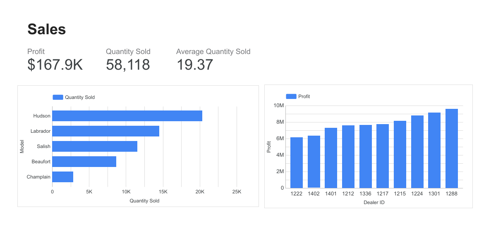
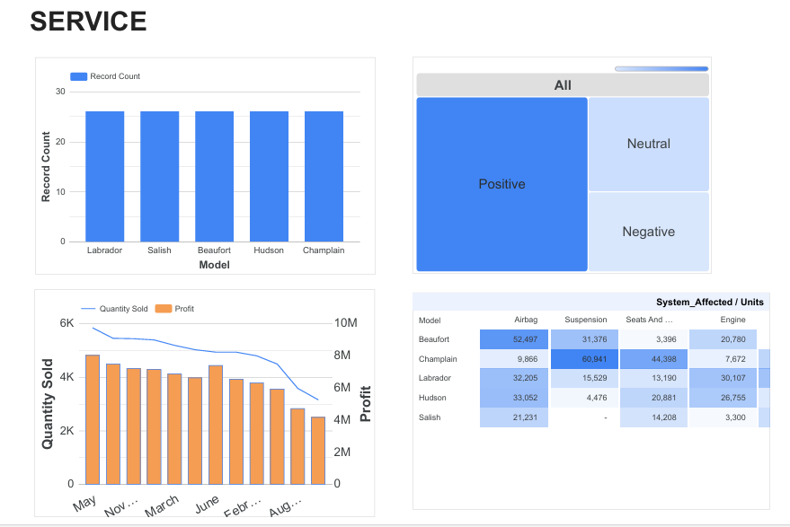

# 🚗 Car Dealership Sales & Services Dashboard
### 🎓 IBM Data Engineering Specialization – Portfolio Project

---

## 📑 Table of Contents
1. [Overview](#-overview)
2. [Business Task](#-business-task)
3. [Dataset Detail](#-dataset-detail)
4. [Tools & Technologies Used](#-tools--technologies-used)
5. [Skills Demonstrated](#-skills-demonstrated)
6. [Project Workflow](#-project-workflow)
7. [Results](#-results)
8. [Key Findings](#-key-findings)
9. [About this Project](#-about-this-project)

---

## 📊 Overview
This project presents an interactive **Business Intelligence dashboard** built using **Google Looker Studio** to analyze **sales performance and services operations** for a car dealership. The dashboard enables high-level monitoring of profitability, sales volume, customer sentiment, and vehicle recalls to support data-driven decision-making.

---

## 🎯 Business Task
As a **regional manager for a chain of car dealerships**, the objective is to:
- Monitor overall **sales performance**
- Evaluate **dealer-level profitability**
- Analyze **customer sentiment**
- Track **vehicle recalls** across models and systems  
All insights are delivered through intuitive dashboards for quick executive review.

---

## 🗂 Dataset Detail
The project uses a **lab-provided, curated dataset** consisting of multiple CSV files:

- **AU_Daily_Sales** – Daily sales transactions, profit, and quantity sold
- **AU_Sales_By_Model** – Sales volume by car model
- **AU_Dealers** – Dealer-level sales and profit information
- **AU_Car_Models** – Reference data for vehicle models
- **AU_Car_Recalls** – Recall records by model and affected system
- **AU_Sentiment** – Customer sentiment (Positive, Neutral, Negative)

> Dataset was uploaded to Google Drive and connected via **Google Sheets connector** in Looker Studio.

---

## 🛠 Tools & Technologies Used
- **Google Looker Studio**
- **Google Sheets**
- **CSV Datasets**
- **Data Visualization**
- **Business Intelligence Concepts**

---

## 🧠 Skills Demonstrated
- BI dashboard design and layout
- KPI identification and visualization
- Sales and service data analysis
- Data source integration in Looker Studio
- Chart selection for business storytelling
- Executive-level reporting

---

## 🔄 Project Workflow
1. **Dataset Preparation**
   - Downloaded lab-provided CSV files
   - Uploaded datasets to Google Drive
   - Converted files to Google Sheets for compatibility

2. **Data Integration**
   - Connected datasets to Google Looker Studio using the Google Sheets connector
   - Managed multiple data sources within a single report

3. **Sales Dashboard Development**
   - Created KPI scorecards for profit and quantity sold
   - Built bar and column charts to analyze sales by model and dealer
   - Applied appropriate formatting and sorting for clarity

4. **Service Dashboard Development**
   - Visualized recall counts by model
   - Analyzed customer sentiment using a treemap
   - Compared quantity sold and profit trends over time
   - Identified recall patterns using a pivot table with heatmap

5. **Finalization**
   - Added titles and labels
   - Organized visuals into two dashboard pages (Sales & Service)
   - Exported the complete report as a PDF for submission and portfolio use

---

## 📈 Results

| 1. Sales Dashboard |
|--------------------|
|  |
| Overview of sales KPIs including profit, quantity sold, average sales, and dealer-wise performance. |

---

| 2. Service Dashboard |
|----------------------|
|  |
| Insights into customer sentiment, recall trends, and service-related performance metrics. |

---

## 🔍 Key Findings
- Certain dealers significantly outperform others in terms of profit
- Sales volume varies notably across car models
- Customer sentiment is predominantly positive with identifiable neutral and negative segments
- Specific car models and systems show higher recall frequencies, highlighting potential quality concerns

---

## ℹ️ About this Project
This dashboard was developed as part of the **BI Dashboards with IBM Cognos Analytics and Google Looker Studio** course within the **IBM Data Engineering Professional Specialization**.  
The project demonstrates practical application of **business intelligence concepts** using industry-standard visualization tools.

---
