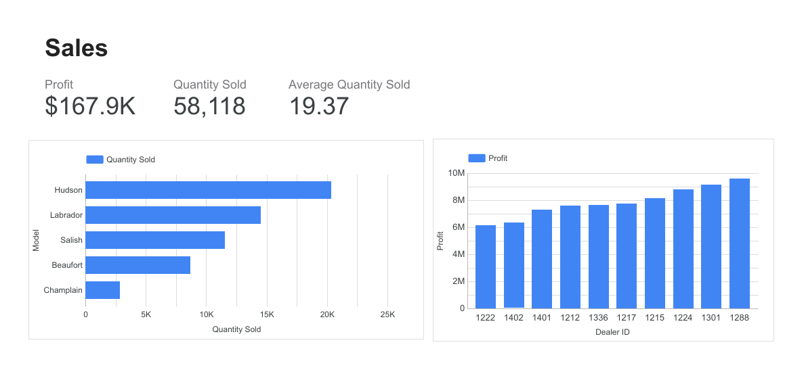
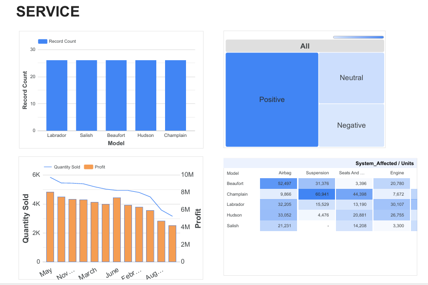

# Car Dealership Sales & Service Dashboard
### IBM Data Engineering Specialization - Portfolio Project

---

## Table of Contents

- [Overview](#overview)
- [Business Task](#business-task)
- [Objectives](#objectives)
- [Dataset](#dataset)
- [Tools & Technologies](#tools--technologies)
- [Methodology](#methodology)
- [Dashboard Design](#dashboard-design)
- [Results](#results)
- [Key Performance Indicators](#key-performance-indicators)
- [Key Findings](#key-findings)
- [About This Project](#about-this-project)

---

## Overview

This project presents an interactive Business Intelligence dashboard built in Google Looker Studio to analyze sales performance and service operations for a car dealership chain. It enables high-level monitoring of profitability, sales volume, customer sentiment, and vehicle recalls to support data-driven decision-making at the regional management level.

---

## Business Task

As a regional manager for a chain of car dealerships, the objective was to:

- Monitor overall sales performance
- Evaluate dealer-level profitability
- Analyze customer sentiment
- Track vehicle recalls across models and systems

All insights needed to be delivered through intuitive dashboards suitable for quick executive review.

---

## Objectives

- Integrate 6 separate CSV data sources into a single, connected Looker Studio report
- Build a Sales dashboard surfacing profit, volume, and dealer-level performance
- Build a Service dashboard surfacing recall trends and customer sentiment
- Package both dashboards into a clean, presentation-ready two-page report

---

## Dataset

| File | Description |
|---|---|
| AU_Daily_Sales | Daily sales transactions, profit, and quantity sold |
| AU_Sales_By_Model | Sales volume by car model |
| AU_Dealers | Dealer-level sales and profit information |
| AU_Car_Models | Reference data for vehicle models |
| AU_Car_Recalls | Recall records by model and affected system |
| AU_Sentiment | Customer sentiment (Positive, Neutral, Negative) |

Lab-provided, curated dataset consisting of 6 CSV files.

---

## Tools & Technologies

| Category | Tools |
|---|---|
| Application | Google Looker Studio |
| Data Source | CSV datasets (Google Sheets connector) |

---

## Methodology

**1. Dataset Preparation**
Downloaded the lab-provided CSV files and converted them to .xlsx format for compatibility with the reporting workflow.

**2. Data Integration**
Connected all 6 datasets to Google Looker Studio using the Google Sheets connector, managing multiple data sources within a single report.

**3. Sales Dashboard Development**
Created KPI scorecards for profit and quantity sold, built bar and column charts to analyze sales by model and dealer, and applied formatting and sorting for clarity.

**4. Service Dashboard Development**
Visualized recall counts by model, analyzed customer sentiment using a treemap, compared quantity sold and profit trends over time, and identified recall patterns using a pivot table with heatmap formatting.

**5. Finalization**
Added titles and labels, organized visuals into two dashboard pages (Sales & Service), and exported the complete report as a PDF for submission and portfolio use.

---

## Dashboard Design

- **Sales page:** KPI scorecards (profit, quantity sold) plus bar/column charts breaking down performance by model and dealer.
- **Service page:** Recall counts by model, a sentiment treemap, profit/quantity trend comparison over time, and a heatmap pivot table for recall pattern detection.
- **Data connection:** All 6 CSV sources connected via the Google Sheets connector, consolidated into one multi-page report.

---

## Results

All screenshots in [`Results/`](./Results).

| # | Dashboard | Screenshot |
|---|-----------|------------|
| 1 | Sales Dashboard - profit, quantity sold, average sales, and dealer-wise performance |  |
| 2 | Service Dashboard - customer sentiment, recall trends, and service-related performance metrics |  |

---

## Key Performance Indicators

| KPI | Tracked Via |
|---|---|
| Profit | KPI scorecard, Sales dashboard |
| Quantity Sold | KPI scorecard, Sales dashboard |
| Sales by Dealer | Bar/column chart, Sales dashboard |
| Sales by Model | Bar/column chart, Sales dashboard |
| Recall Count by Model | Service dashboard |
| Customer Sentiment Distribution | Treemap, Service dashboard |
| Recall Pattern by System | Heatmap pivot table, Service dashboard |

---

## Key Findings

- Certain dealers significantly outperform others on profit, identifying clear priority locations for regional management attention.
- Sales volume varies notably across car models, showing demand is concentrated rather than evenly spread across the lineup.
- Customer sentiment is predominantly positive, with identifiable neutral and negative segments that can be tracked for early service-quality signals.
- Specific car models and systems show higher recall frequencies, highlighting potential quality concerns worth prioritizing in service planning.

---

## About This Project

This dashboard was developed as part of the BI Dashboards with IBM Cognos Analytics and Google Looker Studio course within the IBM Data Engineering Professional Specialization. It demonstrates practical application of business intelligence concepts using industry-standard visualization tools.

---
